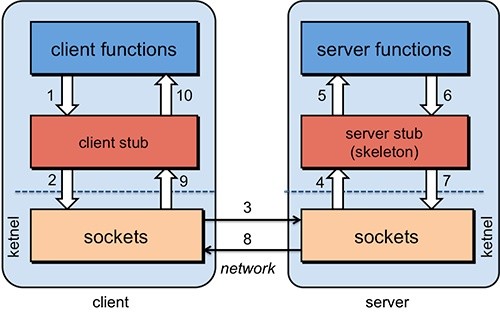
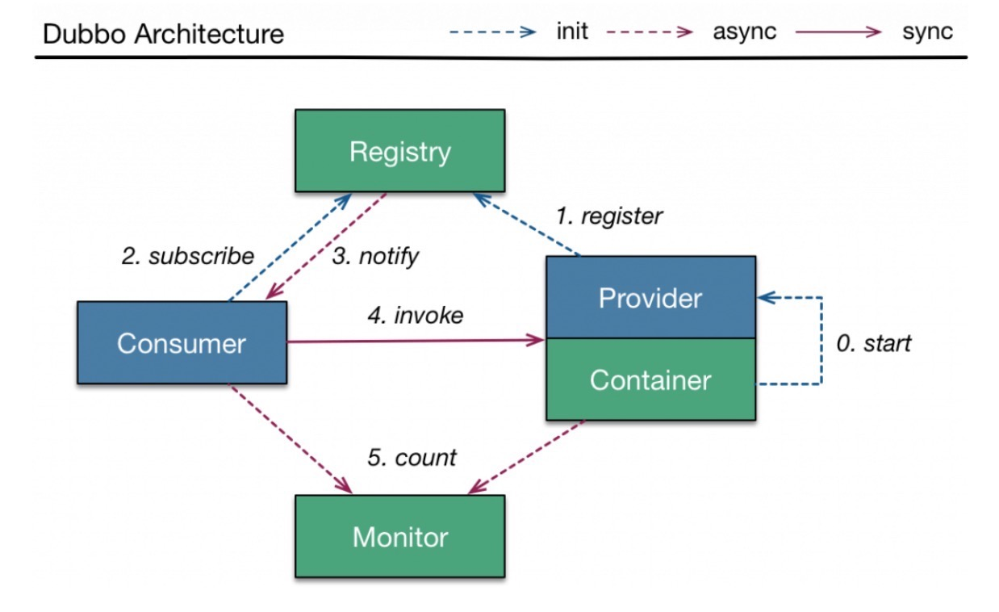
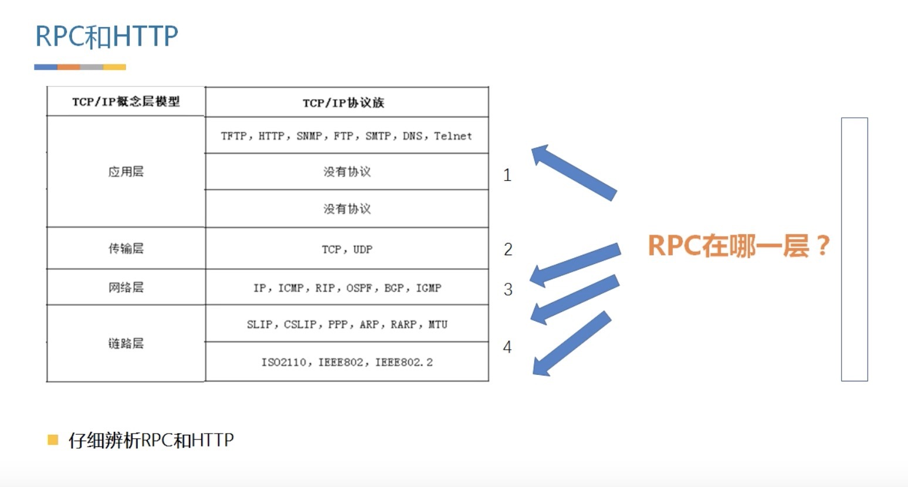

## 分布式和集群的区别
- 分布式：一个业务分拆多个子业务，部署在不同的服务器上，高内聚、低耦合，提高系统并发
- 集群：同一个业务，部署在多个服务器上，提高系统可用性

## what's rpc?
RPC：远程过程调用（Remote Procedure Call）



rpc 需要解决哪些问题？
- 代理问题
- 序列化问题
- 通信问题
- 服务实例化问题

### 代理问题
代理通过动态代理。JKD 动态代理，必须客户端和服务端拥有共同接口才能实现；CGLIB 不需要接口也能实现。RPC 客户端代理一般通过 JDK 动态代理实现。

### 序列化问题
1. JDK 序列化
只需实现 java.io.Serializable 并生成序列化 ID 即可。但是在 RPC 调用很少用到这个，因为存在一些缺点：
（1）无法跨语言
（2）序列化后字节数组体积较大，性能较低

2. XML 序列化框架
XML 序列化在于可读性好，与语言无关性，因为使用标签表示数据流会使得码流变大，因此效率不高。常用的 XML 序列化框架有 XStream

3. JSON 序列化框架
JSON 是一种轻量级的数据交换方式，与语言无关系，相比 XML，JSON 码流更小，而且保持了很好的可读性。常用的 JSON 序列化框架有 Jackson、fastjson、GSON。
相比而言，Jackson、fastjson 比 GSON 性能更好，Jackson、GSON 相比 fastjson 稳定性更好。

4. Hession 序列化框架
Hession 是一种支持跨语言传输的二进制序列化协议，相比 Java 序列化有更好的性能和易用性。目前 Hession3.0 实现功能没有考虑到对于异常信息进行序列化处理。

5. protobuf 序列化框架
Google 的一种数据交换方式，提供了多种语言的实现，protobuf 的文档也非常完善，由于解析性能好、序列化后数据量相对少，适用于应用层对象的持久化场景。但是使用起来比较麻烦，
需要配置开发环境、编写 .proto 文件等。

6. Kyro 序列化框架
底层依赖 ASM 技术，序列化性能优秀，序列化空间也很小，但是跨语言支持比较差；注意的是不支持 Bean 中增删字段，而且是线程不安全的。

7. Thrift 序列化框架
相比 JSON、XML 而言，Thrift 在空间上和解析性能上有了比较大的提升，但是基于二进制的，可读性比较差。不过Thrift的文档相对比较缺乏，目前使用的群众基础相对较少。


### 通信问题
BIO：Blocking IO，例 ServerSocket
NIO：New IO，即多路复用 IO，例 Netty

### 服务实例化问题
反射：在程序运行时，给定任意一个类，都可以获取这个类的属性和方法，给定任意一个对象都可以调用这个对象的属性和方法，这种动态的获取类的信息和调用对象的方法的功能
称之为 Java 反射，Java 反射的主要功能如下：
- 运行时构造一个类的对象
- 运行时获取一个类所有的成员变量和方法
- 运行时调用任意一个对象的方法
- 生成动态代理

更多原理请参考[这篇文章](http://www.fanyilun.me/2015/10/29/Java%E5%8F%8D%E5%B0%84%E5%8E%9F%E7%90%86/) 

```
String className = "com.zfzj.service.reflect.People";

Class<?> clz = Class.forName(className);
Object instance = clz.newInstance();
String methodName = "getFullName";
Class<?>[] parameterTypes = {String.class, String.class};
Object[] arguments = {"jeremy", "wang"};

Method method = clz.getMethod(methodName, parameterTypes);
Object result = method.invoke(instance, arguments);
```

## 与 Dubbo 的区别


- 多线程的线程安全问题
- 性能欠缺、表现在网络通信机制，序列化机制等等
- 没有负载均衡、容灾和集群功能
- 服务并不能很快的动态增加，缺乏服务的注册和发现机制
- 缺少监控机制

TCP(Dubbo) 和 HTTP(Spring Cloud) 哪个更好？
- 通用性
- 性能
- 全面性

Dubbo 面向现在，Spring Cloud 面向未来；引入微服务后，需要引用 Docker 虚拟化技术容器。

如何应付千万级流量架构，Dubbo 或 Spring Cloud 够不够？
Zookeeper、Nginx、Redis等

### TCP/IP 模型


rpc 不属于 TCP/IP 模型中的任何一层，既可以使用 TCP 又可以是用 HTTP 方式去实现。

